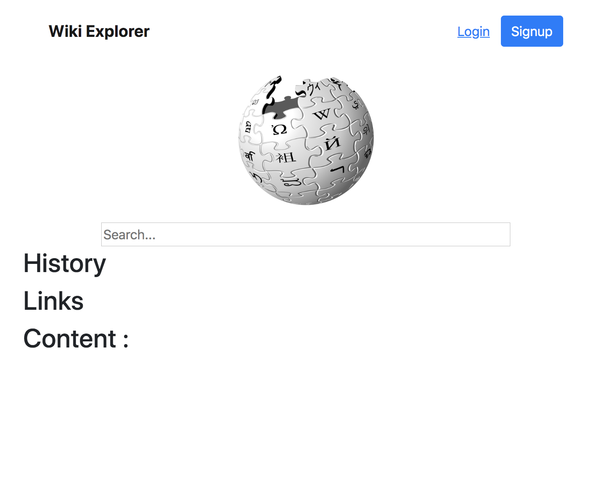

# Final Project

Web application final for searching wiki

## Objective

The objective of this CS5610 final is to search wiki

## Preview



## Tech

This webapp was built focusing on the following technologies:

-   Meteor
-   React

## Installation

```sh
$ git clone git@github.com:neilroutley/wikiFinal.git
$ cd wikiFinal
$ meteor npm install
$ meteor
```
## License

This project is licensed under the MIT License - please see the [LICENSE](LICENSE)

## Author

-   [Neil Routley](https://github.com/neilroutley)

## Grading

- Submitted in class with no extended time or take home.